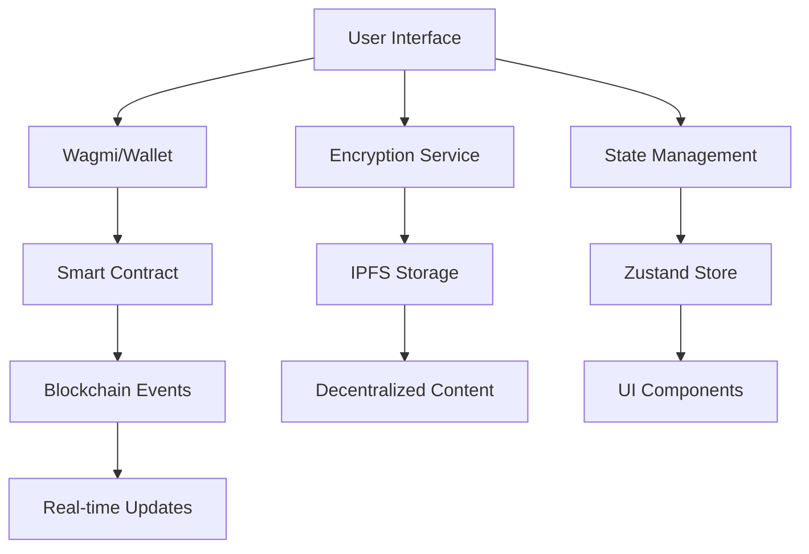

# 🌐 We3Chat - Decentralized Web3 Chat Application

<div align="center">


**A production-ready decentralized chat application built with Web3 technologies**

[🚀 Live Demo](https://we3chat.vercel.app) • [📖 Documentation](#documentation) • [🤝 Contributing](#contributing) • [📄 License](#license)

</div>

---

## ✨ Features

### 🔐 **Privacy & Security**
- **End-to-End Encryption**: X25519 + AES-GCM client-side encryption
- **Decentralized Storage**: IPFS integration for censorship-resistant content
- **Zero-Knowledge Architecture**: No central authority controls your data
- **Client-Side Key Management**: Your keys, your data, your control

### 💬 **Advanced Chat Features**
- **Direct Messaging**: Encrypted peer-to-peer conversations
- **Group Chats**: Multi-participant encrypted group conversations
- **File Sharing**: Secure file transfer with IPFS storage
- **Real-Time Messaging**: Instant message delivery via blockchain events
- **Message History**: Persistent encrypted message storage

### 🌐 **Web3 Integration**
- **Multi-Wallet Support**: MetaMask, WalletConnect, Coinbase Wallet
- **Smart Contract Integration**: On-chain user profiles and friend management
- **Reputation System**: Community-driven user scoring
- **Gas Optimization**: Efficient smart contract interactions
- **Cross-Chain Ready**: Built for Polygon with multi-chain support

### 🎨 **Modern UI/UX**
- **Responsive Design**: Mobile-first approach with TailwindCSS
- **Dark/Light Mode**: Automatic theme switching
- **Real-Time Updates**: Live message synchronization
- **Intuitive Interface**: Clean, modern chat interface
- **Accessibility**: WCAG compliant design

---

## 🏗️ Architecture

### **Frontend Stack**
```
┌─────────────────────────────────────────────────────────────┐
│                    Next.js 15 + TypeScript                  │
├─────────────────────────────────────────────────────────────┤
│  React 19 • TailwindCSS 3 • Zustand • Wagmi • Viem         │
├─────────────────────────────────────────────────────────────┤
│  TweetNaCl • Web3.Storage • IPFS • Web3Modal              │
└─────────────────────────────────────────────────────────────┘
```

### **Smart Contract Stack**
```
┌─────────────────────────────────────────────────────────────┐
│                    Solidity 0.8.19                         │
├─────────────────────────────────────────────────────────────┤
│  OpenZeppelin • Hardhat • Polygon Amoy • TypeChain        │
├─────────────────────────────────────────────────────────────┤
│  User Profiles • Group Chats • Friend System • Reputation │
└─────────────────────────────────────────────────────────────┘
```

### **Data Flow**


---

## 🚀 Quick Start

### **Prerequisites**
- Node.js 18+ and npm
- MetaMask or compatible Web3 wallet
- Git

### **1. Clone & Install**
```bash
git clone https://github.com/deekshith-b48/we3chat.git
cd we3chat
npm install
```

### **2. Environment Setup**
```bash
cp .env.example .env.local
```

Configure your environment variables:
```env
# Web3 Configuration
NEXT_PUBLIC_WALLETCONNECT_PROJECT_ID=your_project_id
NEXT_PUBLIC_POLYGON_RPC_URL=https://rpc-amoy.polygon.technology
NEXT_PUBLIC_CHAT_CONTRACT_ADDRESS=0x...

# IPFS Configuration
NEXT_PUBLIC_WEB3_STORAGE_TOKEN=your_web3_storage_token

# Optional: Supabase (for enhanced features)
NEXT_PUBLIC_SUPABASE_URL=your_supabase_url
NEXT_PUBLIC_SUPABASE_ANON_KEY=your_supabase_key
```

### **3. Deploy Smart Contract**
```bash
cd contracts
npm install
npx hardhat compile
npx hardhat run scripts/deploy.js --network polygonAmoy
```

### **4. Start Development**
```bash
npm run dev
```

Open [http://localhost:3000](http://localhost:3000) to see your application!

---

## 📱 Usage Guide

### **Getting Started**
1. **Connect Wallet**: Click "Connect Wallet" and select your preferred wallet
2. **Create Profile**: Register your username and bio
3. **Add Friends**: Send friend requests to other users
4. **Start Chatting**: Begin encrypted conversations!

### **Key Features**
- **🔐 Encrypted Messaging**: All messages are encrypted client-side
- **👥 Group Chats**: Create and manage group conversations
- **📁 File Sharing**: Share files securely via IPFS
- **⭐ Reputation System**: Rate users and build trust
- **🌐 Cross-Platform**: Works on desktop and mobile

---

## 🛠️ Development

### **Project Structure**
```
we3chat/
├── 📱 Frontend (Next.js)
│   ├── src/
│   │   ├── app/                 # Next.js app router
│   │   ├── components/         # React components
│   │   ├── lib/               # Utilities & services
│   │   ├── hooks/             # Custom React hooks
│   │   └── store/             # Zustand state management
│   ├── public/                # Static assets
│   └── package.json          # Frontend dependencies
│
├── 🔗 Smart Contracts
│   ├── contracts/             # Solidity contracts
│   ├── scripts/              # Deployment scripts
│   ├── test/                 # Contract tests
│   └── hardhat.config.js     # Hardhat configuration
│
├── 🖥️ Backend Services
│   ├── backend/              # Main backend service
│   └── backend-local/        # Local development
│
└── 📚 Documentation
    ├── README.md             # This file
    └── docs/                 # Additional documentation
```

### **Available Scripts**
```bash
# Frontend Development
npm run dev          # Start development server
npm run build        # Production build
npm run start        # Start production server
npm run lint         # Run ESLint

# Smart Contract Development
cd contracts
npx hardhat compile  # Compile contracts
npx hardhat test     # Run tests
npx hardhat deploy  # Deploy contracts
```

### **Technology Stack**

#### **Frontend**
- **Framework**: Next.js 15 with App Router
- **Language**: TypeScript 5.0
- **Styling**: TailwindCSS 3.4.11
- **State Management**: Zustand
- **Web3 Integration**: Wagmi + Viem
- **Encryption**: TweetNaCl (X25519 + AES-GCM)
- **Storage**: Web3.Storage + IPFS

#### **Smart Contracts**
- **Language**: Solidity 0.8.19
- **Framework**: Hardhat
- **Security**: OpenZeppelin (Ownable, ReentrancyGuard)
- **Network**: Polygon Amoy Testnet
- **Testing**: Hardhat Test Suite

#### **Backend**
- **Runtime**: Node.js + TypeScript
- **Database**: Supabase (PostgreSQL)
- **Authentication**: SIWE (Sign-In with Ethereum)
- **Real-time**: WebSocket subscriptions

---

## 🔧 Configuration

### **Smart Contract Configuration**
```javascript
// contracts/hardhat.config.js
module.exports = {
  solidity: "0.8.19",
  networks: {
    polygonAmoy: {
      url: process.env.POLYGON_RPC_URL,
      accounts: [process.env.PRIVATE_KEY]
    }
  }
};
```

### **Frontend Configuration**
```typescript
// src/lib/wagmi.ts
export const config = createConfig({
  chains: [polygonAmoy],
  connectors: [injected(), walletConnect(), coinbaseWallet()],
  transports: {
    [polygonAmoy.id]: http(process.env.NEXT_PUBLIC_POLYGON_RPC_URL)
  }
});
```

---

## 🧪 Testing

### **Smart Contract Tests**
```bash
cd contracts
npx hardhat test
```

### **Frontend Tests**
```bash
npm test
```

### **End-to-End Tests**
```bash
npm run test:e2e
```

---

## 🚀 Deployment

### **Frontend Deployment (Vercel)**
```bash
npm run build
vercel --prod
```

### **Smart Contract Deployment**
```bash
cd contracts
npx hardhat run scripts/deploy.js --network polygonAmoy
```

### **Docker Deployment**
```bash
docker-compose up -d
```

---

## 📊 Performance

### **Optimizations**
- **Bundle Size**: Tree-shaking and code splitting
- **Loading**: Lazy loading and dynamic imports
- **Caching**: Smart contract data caching
- **Compression**: Gzip compression for assets

### **Metrics**
- **First Contentful Paint**: < 1.5s
- **Largest Contentful Paint**: < 2.5s
- **Time to Interactive**: < 3.0s
- **Bundle Size**: < 500KB gzipped

---

## 🔒 Security

### **Smart Contract Security**
- **Audited**: OpenZeppelin security patterns
- **Access Control**: Role-based permissions
- **Reentrancy Protection**: Secure state management
- **Input Validation**: Comprehensive parameter checking

### **Frontend Security**
- **Encryption**: Client-side message encryption
- **Key Management**: Secure key storage
- **HTTPS**: Enforced secure connections
- **CSP**: Content Security Policy headers

---

## 🤝 Contributing

We welcome contributions! Please see our [Contributing Guide](CONTRIBUTING.md) for details.

### **Development Workflow**
1. Fork the repository
2. Create a feature branch
3. Make your changes
4. Add tests if applicable
5. Submit a pull request

### **Code Standards**
- **TypeScript**: Strict type checking
- **ESLint**: Code quality enforcement
- **Prettier**: Code formatting
- **Husky**: Pre-commit hooks

---

## 📄 License

This project is licensed under the MIT License - see the [LICENSE](LICENSE) file for details.

---

## 🙏 Acknowledgments

- **OpenZeppelin** for secure smart contract patterns
- **Wagmi** for Web3 React hooks
- **Next.js** for the amazing framework
- **TailwindCSS** for utility-first styling
- **Web3.Storage** for decentralized storage

---

## 📞 Support

- **Documentation**: [docs.we3chat.com](https://docs.we3chat.com)
- **Discord**: [Join our community](https://discord.gg/we3chat)
- **Twitter**: [@We3Chat](https://twitter.com/we3chat)
- **Email**: support@we3chat.com

---

<div align="center">

**Built with ❤️ by the We3Chat Team**

[⭐ Star this repo](https://github.com/deekshith-b48/we3chat) • [🐛 Report Bug](https://github.com/deekshith-b48/we3chat/issues) • [💡 Request Feature](https://github.com/deekshith-b48/we3chat/issues)

</div>